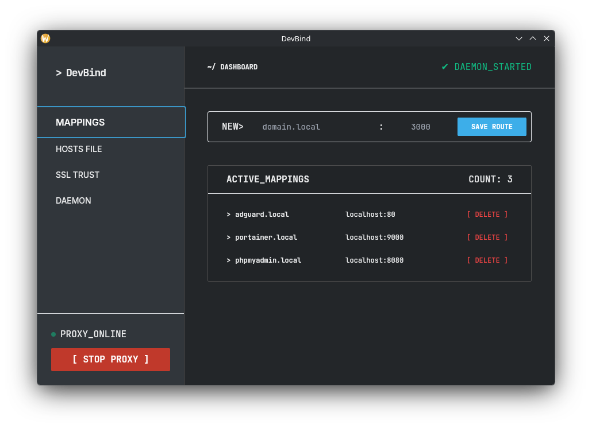
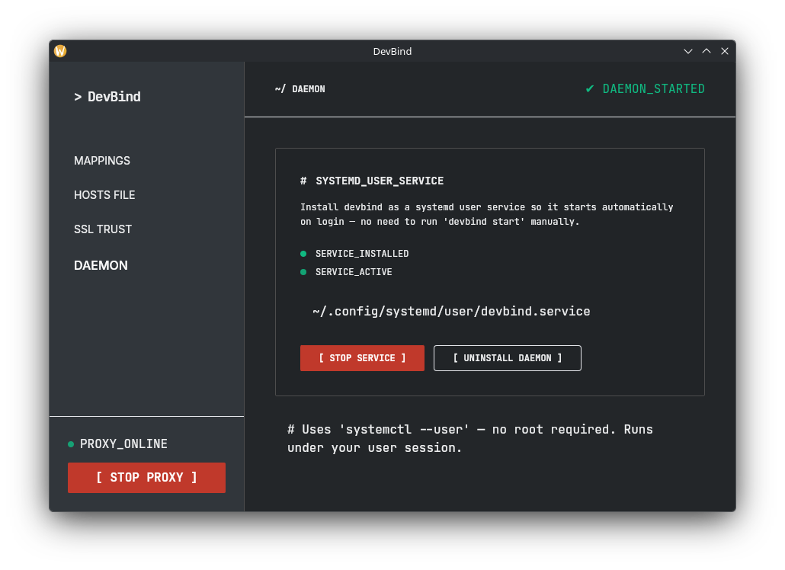
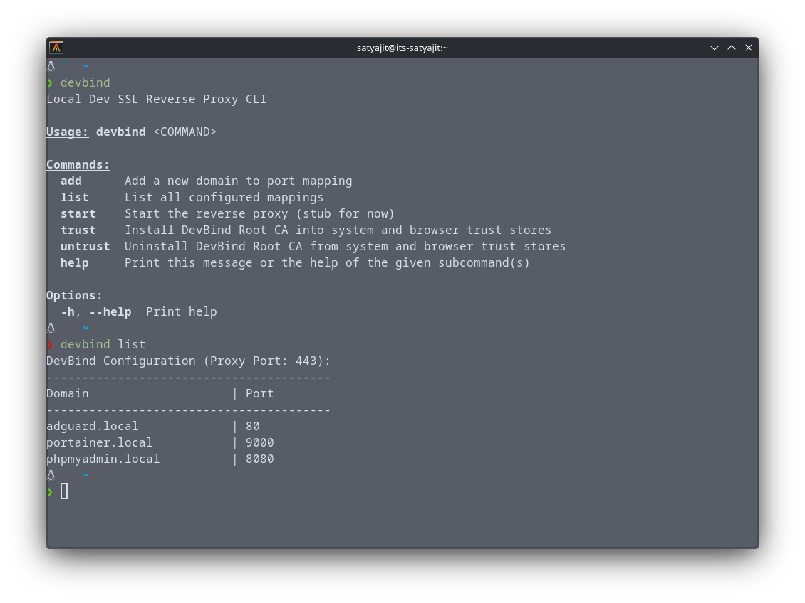

# DevBind: Local Development Reverse Proxy with Automatic HTTPS

**DevBind** is a high-performance, secure local development reverse proxy written in Rust. It eliminates the friction of modern local development by mapping custom `.test` domains to your dev server ports with **Automatic HTTPS** — no more browser security warnings, no manual certificate management, and no `/etc/hosts` headaches.



## Why DevBind?

Modern web development requires HTTPS, but setting it up locally is a nightmare.

| The Old Way | The DevBind Way |
| :--- | :--- |
| ❌ Manual certificate generation with `openssl` | ✅ **Automatic TLS** for every `.test` domain |
| ❌ Importing Root CAs into every browser manually | ✅ **One-click trust** for system and browser stores |
| ❌ Manually editing `/etc/hosts` for every new project | ✅ **Zero-Config DNS** resolution managed by DevBind |
| ❌ Scary "Your connection is not private" warnings | ✅ **Green locks** and valid HTTPS everywhere |

## Key Features

- **Instant HTTPS Everywhere** — Automatically generates and signs per-domain certificates using an in-memory CA. Zero disk I/O after the first handshake.
- **Frictionless Domain Mapping** — Map `myapp.test` → `localhost:3000` in seconds.
- **Ephemeral Run Environment** — Launch apps with `devbind run` to automatically assign a free port, inject `$PORT`, and register transient `.test` HTTPS routes with zero permanent config.
- **Enterprise-Grade Routing** — `HashMap`-based O(1) lookups ensure your local environment never slows down, even with hundreds of domains.
- **Smart Hot-Reloading** — Config reloads only when needed (at most every 5s), preserving performance.
- **Native Streaming Proxy** — Efficiently streams response bodies directly — no RAM buffering or latency.
- **Hardened Security** — Private keys are stored with `0600` permissions. Root CA management follows system-level security standards.
- **Zero-Config Trust** — Automatically handles NSS databases for Chrome, Firefox, Brave, Zen, and even Flatpak/Snap versions.
- **Background Daemon** — Runs as a standard systemd user service for seamless autostart without needing root.
- **Hybrid Interface** — Choose between a high-performance CLI or a beautiful Dioxus-powered GUI.

## Requirements

Install `libnss3-tools` for browser trust management:

```bash
# Arch / Manjaro
sudo pacman -S nss

# Debian / Ubuntu / Pop!_OS
sudo apt install libnss3-tools
```

A working `polkit` agent is required for GUI privilege escalation (`pkexec`).

## Installation

```bash
git clone https://github.com/Its-Satyajit/dev-bind.git
cd dev-bind
./install.sh
```

`install.sh` will:
1. Build **both** `devbind` (CLI) and `devbind-gui` (GUI) via `cargo build --release`
2. Copy them to `~/.local/bin`
3. Grant `CAP_NET_BIND_SERVICE` so DevBind can bind ports `80`/`443` without root
4. Register a `.desktop` launcher for your application menu

### Reinstalling / Updating

If DevBind is currently running, stop it first — Linux won't overwrite a busy executable:

```bash
# Stop the systemd service (if installed as daemon)
systemctl --user stop devbind

# Or kill the process directly
pkill -x devbind

# Then reinstall
./install.sh
```

### Uninstalling

```bash
# 1. Stop and remove the systemd service (if installed)
systemctl --user stop devbind
systemctl --user disable devbind
rm -f ~/.config/systemd/user/devbind.service
systemctl --user daemon-reload

# 2. Remove the Root CA from system & browser trust stores
devbind untrust

# 3. Remove the binaries and desktop launcher
rm -f ~/.local/bin/devbind ~/.local/bin/devbind-gui
rm -f ~/.local/share/applications/devbind.desktop

# 4. (Optional) Remove config and certificates
devbind uninstall # remove DNS integration
rm -rf ~/.config/devbind
```

## Quick Start

```bash
# 1. Launch the GUI
devbind-gui

# — or use the CLI —

# 1. Add a domain mapping
devbind add myapp 3000        # maps myapp.test → 127.0.0.1:3000

# 2. Start the proxy
devbind start

# 3. Install DNS routing & Root CA (one-time setup)
devbind install
devbind trust

# 4. Open https://myapp.test in your browser

### Ephemeral App Execution
You can bypass manual port management entirely by letting DevBind inject a free port into your app runner:

```bash
# Maps https://my-blog.test to a random free port and executes the script
devbind run my-blog pnpm run dev --port \$PORT
```
Your app simply receives `$PORT`, `$HOST`, and `$DEVBIND_DOMAIN` in its environment. DevBind automatically cleans up the proxy route when the app exits.
```

## Powerful GUI & CLI

DevBind provides the best of both worlds: a minimalist CLI for automation and a premium GUI for visual management.

### Domain Mappings
Add, view, and remove your `domain → port` mappings. Domains are clickable, opening your secure local site instantly in your default browser.


### Background Daemon Management
Turn DevBind into a background service that just works. No long-running terminal tabs required.



| Action | Description |
|---|---|
| **Install Daemon** | Sets up the `systemd` user service unit |
| **Start/Stop** | Precise control over the background process |
| **Proxy Status** | Live status indicator (checks port 443 in real-time) |

### CLI Quick Reference



| Command | Description |
|---|---|
| `devbind start` | Start the proxy (HTTPS on 443, HTTP→HTTPS redirect on 80) |
| `devbind add <name> <port>` | Map `<name>.test` to local `<port>` |
| `devbind run <name> <cmd...>` | Dynamically allocate a free port, proxy HTTPS, and run `<cmd>` with `$PORT` injected |
| `devbind list` | Show all active domain mappings |
| `devbind trust` | Install Root CA into system & browser trust stores |
| `devbind untrust` | Remove Root CA from all trust stores |

## Architecture

```
Browser → 127.0.0.1:443 (TLS) → DevBind proxy → 127.0.0.1:<port> (local app)
              ↑
        SNI-based cert resolution
        (in-memory CA → generated on fly)

DevBind includes an embedded DNS server on `127.0.2.1:53` which `systemd-resolved` forwards `*.test` queries to.
```

- **`core`** — proxy engine, cert manager, hosts manager, config, CA trust
- **`cli`** — thin CLI wrapper around `core`
- **`gui`** — Dioxus desktop GUI

Config: `~/.config/devbind/config.toml`
Certs: `~/.config/devbind/certs/`
Service: `~/.config/systemd/user/devbind.service`

## Troubleshooting

### Permission Denied on port 80/443
`install.sh` grants `CAP_NET_BIND_SERVICE` via `setcap`. If it failed:
```bash
sudo setcap 'cap_net_bind_service=+ep' ~/.local/bin/devbind
```

### Browser shows "Your connection is not private"
1. Run `devbind trust` or use **SSL TRUST → INSTALL TRUST** in the GUI
2. Ensure `libnss3-tools` is installed
3. Restart your browser

### `DNS_PROBE_FINISHED_NXDOMAIN`
DevBind uses a NetworkManager dummy interface to resolve `*.test` domains cleanly. If resolving fails, make sure you ran `devbind install`. If a restrictive VPN ignores system resolvers, you may need to manually forward `*.test` queries to `127.0.2.1:53`.

### Proxy not starting as a daemon
Ensure `systemd --user` is running in your session:
```bash
systemctl --user status
```

## License

MIT — see [LICENSE](LICENSE).
