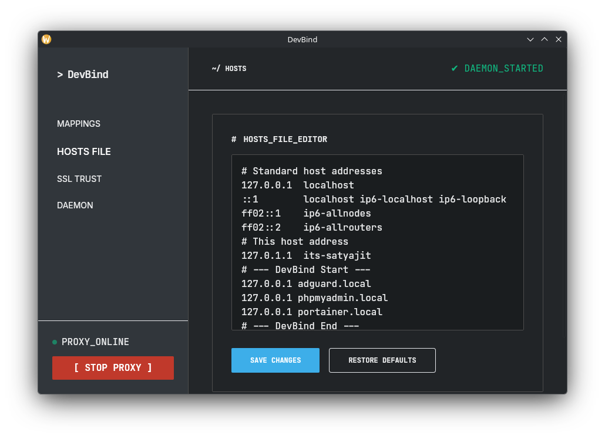
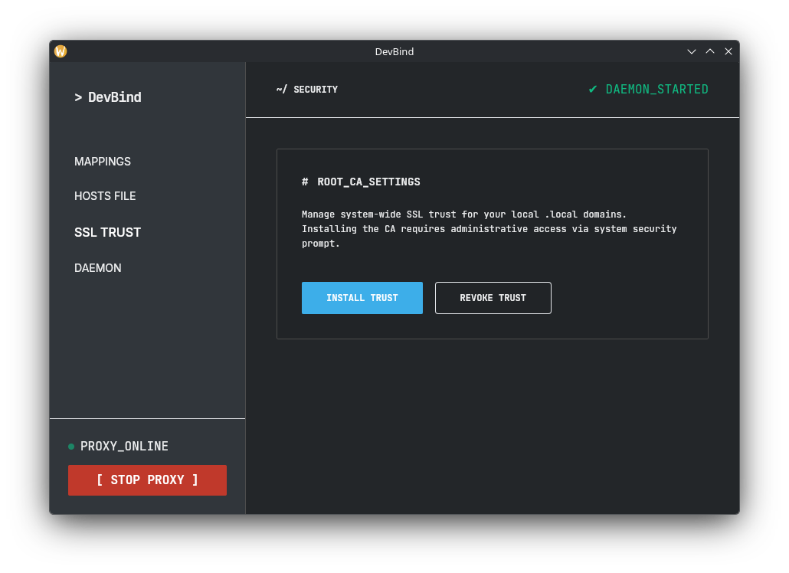

# DevBind

**DevBind** is a fast, secure local development reverse proxy written in Rust. It maps custom `.local` domains to local dev server ports with automatic HTTPS — no browser security warnings, no manual certificate management.


## Features

- **Automatic HTTPS** — Generates per-domain TLS certificates signed by a local Root CA. In-memory cert cache means zero disk I/O after the first handshake per domain.
- **Domain → Port Mapping** — Map `myapp.local` → `localhost:3000` in one command.
- **O(1) Routing** — `HashMap`-based domain lookup; doesn't slow down as you add more domains.
- **Config Hot-Reload** — Routes are reloaded at most once every 5 seconds — not on every connection.
- **Streaming Proxy** — Response bodies stream directly between client and backend — no full RAM buffering.
- **Secure Key Storage** — Private keys written with `0600` permissions (owner-only) on Unix.
- **CA Trust Management** — Installs/removes the Root CA across system stores and browser NSS databases (Chrome, Firefox, Brave, Zen, Flatpak, Snap).
- **systemd Daemon** — Install as a user-level systemd service for autostart on login (no root needed).
- **Dual Interface** — GUI (Dioxus desktop) and full-featured CLI.
- **Privilege Escalation** — Uses `pkexec` (GUI) or `sudo` (CLI) only when writing to `/etc/hosts` or system cert stores.
- **Cross-distro** — Arch, Fedora, Debian, Ubuntu and derivatives.

## Requirements

Install `libnss3-tools` for browser trust management:

```bash
# Arch / Manjaro
sudo pacman -S nss

# Debian / Ubuntu / Pop!_OS
sudo apt install libnss3-tools
```

A working `polkit` agent is required for GUI privilege escalation (`pkexec`).

## Installation

```bash
git clone https://github.com/Its-Satyajit/dev-bind.git
cd dev-bind
./install.sh
```

`install.sh` will:
1. Build release binaries (`cargo build --release`)
2. Copy `devbind` and `devbind-gui` to `~/.local/bin`
3. Grant `CAP_NET_BIND_SERVICE` so DevBind can bind ports `80`/`443` without root
4. Register a `.desktop` launcher for your application menu

## Quick Start

```bash
# 1. Launch the GUI
devbind-gui

# — or use the CLI —

# 1. Add a domain mapping
devbind add myapp 3000        # maps myapp.local → 127.0.0.1:3000

# 2. Start the proxy
devbind start

# 3. Install the Root CA so browsers trust your certs
devbind trust

# 4. Open https://myapp.local in your browser
```

## GUI

Launch with `devbind-gui` or from your app menu.

### MAPPINGS

Add, view and remove domain → port mappings. Click any domain link to open it directly in your browser.


### HOSTS FILE

Directly view and edit `/etc/hosts`. Changes are written via `pkexec` (no terminal needed).



### SSL TRUST

One-click Root CA install/uninstall across system and browser trust stores.



### DAEMON

Install DevBind as a **systemd user service** so the proxy starts automatically on login.


| Button | Action |
|---|---|
| `INSTALL DAEMON` | Writes `~/.config/systemd/user/devbind.service`, enables and starts it |
| `START SERVICE` | `systemctl --user start devbind` |
| `STOP SERVICE` | `systemctl --user stop devbind` |
| `UNINSTALL DAEMON` | Stops, disables and removes the unit file |

> No root required — runs entirely as a user service.

### Proxy Status

The sidebar always shows a live **PROXY_ONLINE / PROXY_OFFLINE** indicator (checks port 443 in real time) with a quick **START / STOP PROXY** button for manual control without using systemd.

## CLI Reference


| Command | Description |
|---|---|
| `devbind start` | Start the proxy (HTTPS on 443, HTTP→HTTPS redirect on 80) |
| `devbind add <name> <port>` | Map `<name>.local` to local `<port>` |
| `devbind list` | Show all active domain mappings |
| `devbind trust` | Install Root CA into system & browser trust stores |
| `devbind untrust` | Remove Root CA from all trust stores |

## Architecture

```
Browser → 127.0.0.1:443 (TLS) → DevBind proxy → 127.0.0.1:<port> (local app)
              ↑
        SNI-based cert resolution
        (in-memory cache → disk fallback → generate & sign)
```

- **`core`** — proxy engine, cert manager, hosts manager, config, CA trust
- **`cli`** — thin CLI wrapper around `core`
- **`gui`** — Dioxus desktop GUI

Config: `~/.config/devbind/config.toml`
Certs: `~/.config/devbind/certs/`
Service: `~/.config/systemd/user/devbind.service`

## Troubleshooting

### Permission Denied on port 80/443
`install.sh` grants `CAP_NET_BIND_SERVICE` via `setcap`. If it failed:
```bash
sudo setcap 'cap_net_bind_service=+ep' ~/.local/bin/devbind
```

### Browser shows "Your connection is not private"
1. Run `devbind trust` or use **SSL TRUST → INSTALL TRUST** in the GUI
2. Ensure `libnss3-tools` is installed
3. Restart your browser

### `DNS_PROBE_FINISHED_NXDOMAIN`
DevBind writes to `/etc/hosts` automatically. If a VPN or network manager overwrites it, re-run `devbind add` or restart the proxy.

### Proxy not starting as a daemon
Ensure `systemd --user` is running in your session:
```bash
systemctl --user status
```

## License

MIT — see [LICENSE](LICENSE).
