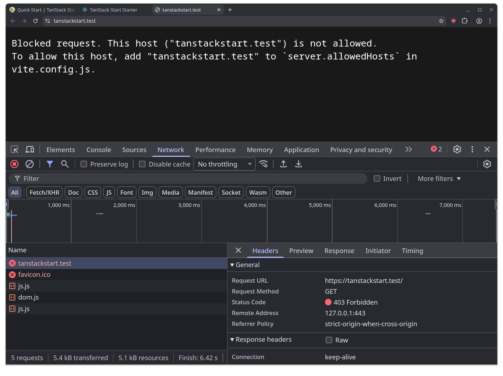
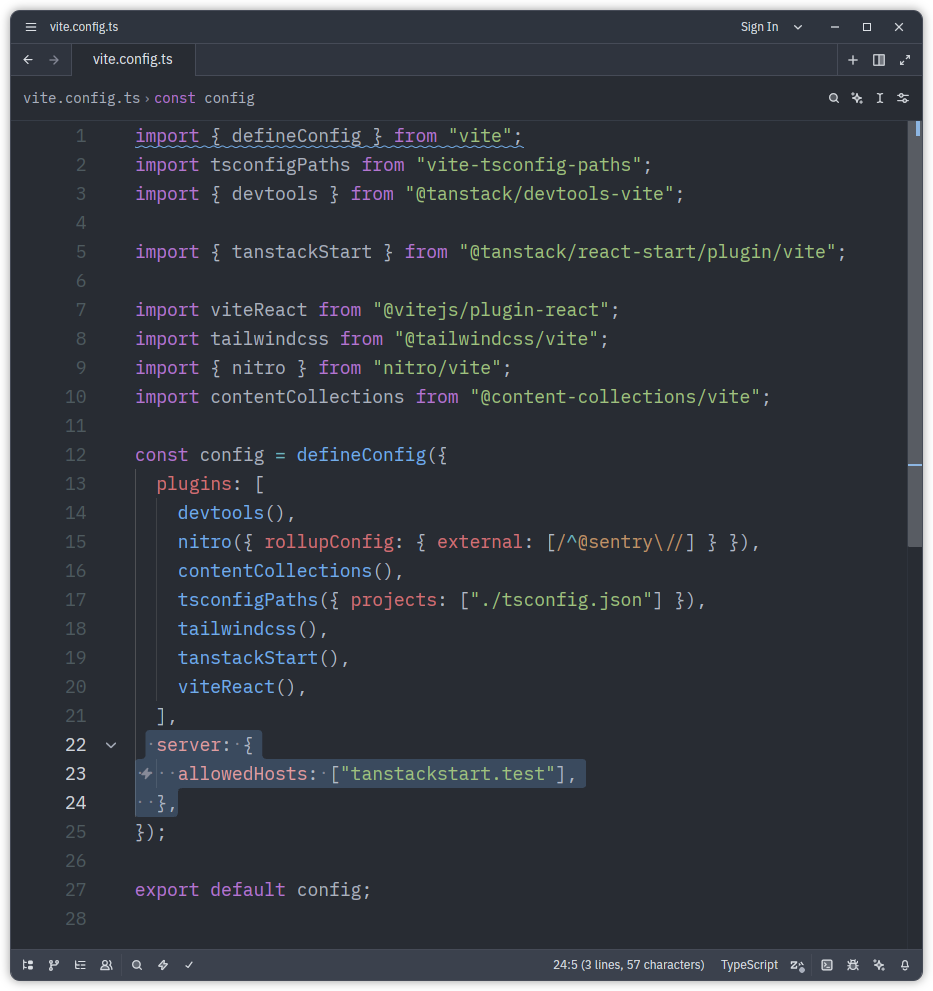
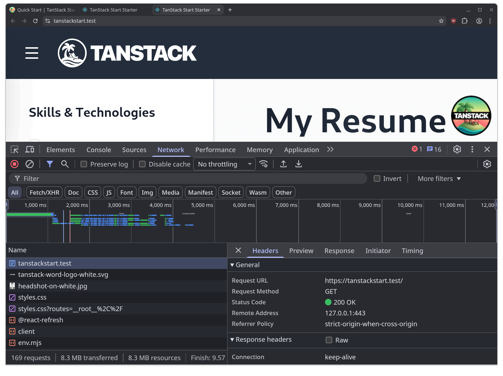

# DevBind Troubleshooting

Here are solutions to the most common issues you might encounter while using DevBind.

---

### Framework "Bad Gateway" or "Invalid Host" (Vite, Next.js)
Modern frameworks strictly validate the `Host` header to prevent DNS rebinding attacks. When DevBind proxies your `.test` domain, the framework might reject it.
- **Vite (React/Vue/Svelte/TanStack)**: Vite binds to `localhost` and `::1` (IPv6) by default. You must pass `--host` to bind to IPv4 so DevBind can reach it.

  

  You also need to whitelist `.test` domains in `vite.config.js`:
  ```javascript
  export default defineConfig({
    server: { allowedHosts: ['react.test'] }
  })
  ```
  

  *Example:* `devbind run react pnpm dev --port $PORT --host`

  
- **Next.js**: Automatically works, but you may see a CLI warning. To silence it, add `allowedDevOrigins: ["*.test"]` to your Next config's experimental features.

## System & Connectivity Issues

### Permission Denied on port 80/443
`install.sh` grants `CAP_NET_BIND_SERVICE` via `setcap`. If it failed:
```bash
sudo setcap 'cap_net_bind_service=+ep' ~/.local/bin/devbind
```

### Browser shows "Your connection is not private"
1. Run `devbind trust` or use **SSL TRUST → INSTALL TRUST** in the GUI
2. Ensure `libnss3-tools` is installed
3. Restart your browser

### `DNS_PROBE_FINISHED_NXDOMAIN`
DevBind uses a NetworkManager dummy interface to resolve `*.test` domains cleanly. If resolving fails, make sure you ran `devbind install`. If a restrictive VPN ignores system resolvers, you may need to manually forward `*.test` queries to `127.0.2.1:53`.

### Proxy not starting as a daemon
Ensure `systemd --user` is running in your session:
```bash
systemctl --user status
```
